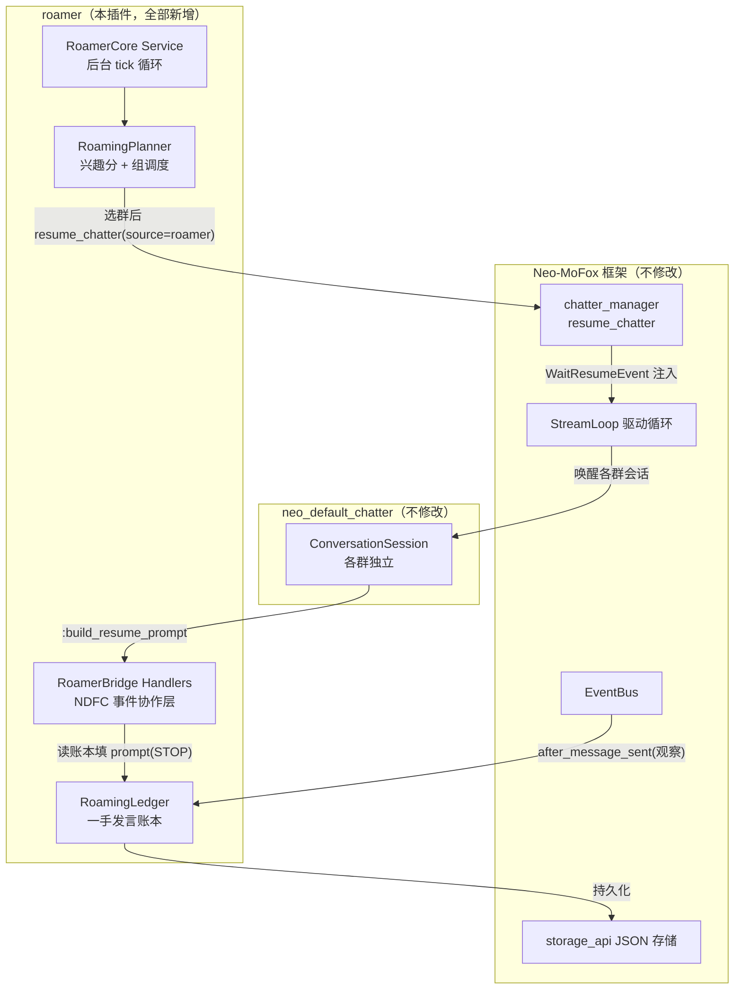
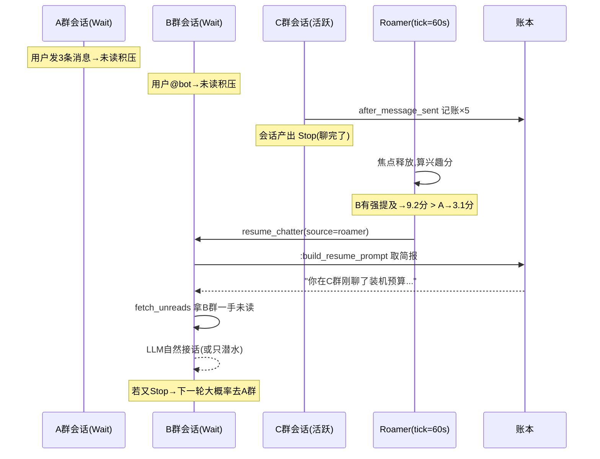

# Roamer 设计文档

> 插件名：`roamer`
> 定位：**多群"辗转腾挪"调度层**——在并行性与跨群互通之间提供连续可调的权衡。
> 依赖：`neo_default_chatter`（NDFC，软依赖，仅订阅其事件，不 import 其内部代码）
> 硬约束：**只新增本插件目录内文件，不修改任何其他文件**（含 NDFC 与框架）。

---

## 0. 需求还原（先把"说不清楚"说清楚）

用户原始诉求（群聊记录整合）：

1. 想让 Bot 像真人一样在多个群之间"辗转腾挪"：在 A、B 群有人在聊，Bot 在 C 群聊完之后，会"回到" B 群和 A 群再聊；
2. 回到 A/B 群时，**记得自己在 C 群聊了什么**（跨群记忆）；
3. 上下文是**一手信息**——不经过"聊天流二次转手"造成信息损失；
4. 依赖 NDFC，**提供并行能力也提供互通**；
5. 非侵入：不影响其他 chatter 插件的使用（NDFC 只是被钩了几个事件，不修改其代码）。
6. 【已有前置讨论的结论，直接继承】调度变慢的根因是竞态：既想要并行又想要完全互通，就必须处理竞态。

### 0.1 关键洞察：一手信息 ≠ 消息转发

聊天流二次转手的本质问题是：把 C 群的消息搬运到 A 群的 prompt 里，既损失格式（图片/表情/回复链），又引入转写偏差。而本插件的核心主张是：

> **一手信息不需要转发。每个群的未读队列本身就是一手信息的唯一真相源。**

Neo-MoFox 框架里，每个聊天流（stream）有独立的：
- 未读消息队列（`fetch_unreads` 拿到的 `Message` 列表，原生对象）
- 会话上下文（LLM 请求的 payloads 历史）
- 调度循环（`WaitResumeEvent` 驱动的协程）

因此"Bot 在 C 群聊完，回到 B 群"在框架语义下就是一句话：**通过 `chatter_manager.resume_chatter()` 把 B 群的 NDFC 会话唤醒**。B 群会话自己执行 `fetch_unreads`，拿到的是 B 群本地未读的原生 `Message` 对象——发送者、时间、回复链、图片占位符全部原生保留，零信息损失、零转写偏差。A 群同理。

**Roamer 做的事情只有两件：**

1. **决定"接下来去哪个群"**（漫游规划）——控制唤醒顺序与时机；
2. **注入"我去过哪、说了什么"的简报**（漫游记忆）——跨群互通的一手凭据。

第 2 点是唯一需要"搬运"的信息，但它搬运的是 **Bot 自己的发言**（Bot 在 C 群说了什么），不是用户消息的转写。Bot 自己的发言由 `after_message_sent` 系统事件原生携带完整 `Message` 对象，记账即一手，不经过任何二次转手。

### 0.2 拟人模型：注意力即在场

真人的"在多个群辗转腾挪"本质是**单点注意力 + 记忆连续**：

| 真人行为 | 框架语义 | Roamer 对应机制 |
| --- | --- | --- |
| 此刻人在 C 群聊 | C 群会话活跃（MODEL_TURN） | 全域互斥：同一时刻整个漫游域只有一个"焦点群" |
| A/B 群消息先攒着不看 | 未读队列（框架原生，无需实现） | 不做任何事，天然支持 |
| C 群聊完，想起 B 群好像有人说话 | 兴趣分排序，选下一站 | RoamingPlanner 计算"回去看看"的优先级 |
| 回到 B 群，翻下没看的消息 | `resume_chatter` → `fetch_unreads` | 唤醒后 NDFC 自己拉一手未读 |
| 还记得刚才在 C 群聊了什么 | 跨群记忆 | RoamingLedger → resume prompt 注入简报 |
| 回来了但不一定插话 | preprocess 概率门 / sub-agent 判定 | 不拦截 NDFC 原生决策，"回去看"≠"回去说" |

最后一行是拟人感的关键：**"回到群里"与"在群里发言"解耦**。Roamer 只负责把会话唤醒（等同真人打开了聊天窗口），说不说话仍由 NDFC 原生的 preprocess 决策链决定——被 @ 了大概率接话，只是普通闲聊可能只潜水。

---

## 1. 目标与非目标

### 1.1 目标

- **G1 多群在场感**：Bot 在配置的"漫游域"内表现出连续的、单注意力的多群活动轨迹；
- **G2 跨群互通**：任何一群的会话都能（按配置粒度）知晓 Bot 最近在其他群的发言与话题；
- **G3 一手信息**：互通内容仅限 Bot 自身发言账本 + 各群本地未读，绝无跨群搬运用户消息；
- **G4 并行可调**：从全串行（最拟人）到全并行（最 responsive）连续可调；
- **G5 零侵入**：不修改 NDFC / 框架 / 其他插件的任何文件；不干扰其他 chatter 插件。

### 1.2 非目标

- ❌ 跨群转发用户消息、图片或聊天记录（明确禁止，见 §3.1）；
- ❌ 替代 NDFC 的回复决策（说不说话、说什么仍是 NDFC 的事）；
- ❌ 修改 NDFC 的人格 prompt / 工具集（只做事件协作与注入）;
- ❌ 支持 NDFC 之外的 chatter（v1 只对 `neo_default_chatter` 事件生效；其他 chatter 因不走这些事件，天然不受影响，也天然不被管理）。

### 1.3 v0.2 原文搬运可靠性契约

v0.2 在账本简报之外新增了插件私有 SQLite 镜像：漫游域内的消息原文与 Bot
的工具/动作调用流水分别写入独立表。`cross_stream_feed` 和可选的每轮注入都
从该镜像读取；镜像不可用时才回退到目标流的框架历史查询。

- 披露由源/目标聊天类型矩阵控制。私聊到群聊默认关闭，未知源类型同样拒绝
    披露；回退查询与镜像查询遵守相同的窗口、游标与方向规则。
- 自动注入采用 ACK 游标。每个跨群内容块带有独立批次标识，`before_llm_request`
    仅在实际发送的 payload 含该标识时将批次绑定到请求；成功请求才提交该批次的
    游标，失败请求只丢弃该批次。无关请求和其他流的请求不能确认它。
- 数据完整性优先于去重。当单流条数或源流数量到达展示上限时，内容仍可展示，
    但该批次不生成可提交游标，避免因截断跳过未展示的动态；繁忙场景可能重复携带
    少量内容。
- Tool 拉取不推进自动注入游标，因为 Tool 的参数同样可能截断结果。它提供主动
    查看能力，但不会把未覆盖的数据标记为已消费。

### 1.4 v0.2 并行调度契约

parallel 模式不再是"只互通不调度"，而是受限并发唤醒：

- 每 tick 由 planner 按同一套兴趣分（对数吸引力 + 回访节流 + 强提及/私聊豁免）
  排序，选出至多 `max_parallel_wakes`（默认 2）个互不相同的流并发 resume；
- parallel 模式**不占用全域焦点**（`focus_stream` 恒 None，`acquire_focus`
  不调用），但回访/活跃登记照常——并行节流依赖它；
- 请求级 carry 批次标识与并发天然兼容：每个被唤醒的流的注入块有独立批次 ID，
  `before_llm_request` 只绑定实际携带它的请求，串流不可能误 ACK；
- 批次内流经 `visit_lock` 串行执行（IO 串行、决策并发），即并发唤醒是
  "决策并行、执行有序"，锁竞争与超时行为可预测。




组件清单（全部位于 `plugins/roamer/`，均为本插件内部代码）：

| 组件 | 类型 | 职责 |
| --- | --- | --- |
| `RoamerCore` | Service | 生命周期 + 周期 tick（`task_manager` 托管后台任务） |
| `RoamingPlanner` | 内部类 | 兴趣分计算、组调度、唤醒节流 |
| `RoamingLedger` | 内部类 | Bot 发言账本：收集、摘要、老化、持久化 |
| `LedgerRecordHandler` | EventHandler | 订阅 `AFTER_MESSAGE_SENT`，记账（纯观察） |
| `RoamerResumeHandler` | EventHandler | 订阅 NDFC `:build_resume_prompt`，注入漫游简报 |
| `RoamerExtraHandler` | EventHandler | 订阅 `ON_PROMPT_BUILD`，协作注入“其他群动态”小节（可选） |
| `RoamerFocusGate` | EventHandler | 订阅 NDFC `:preprocess`，串行专注门（可选，默认关） |
| `RoamerCommands` | Command | `/roamer status/visit/pause` 运维命令 |

---

## 3. 核心机制

### 3.1 RoamingLedger：一手发言账本

**数据来源**：框架系统事件 `EventType.AFTER_MESSAGE_SENT`（`src/core/components/types.py:56`）。Bot 每发一条消息必触发，payload 携带完整 `Message` 对象。Handler 按 `stream_id ∈ 漫游域` 过滤后记一条：

```python
@dataclass(slots=True)
class LedgerEntry:
    stream_id: str          # 发言所在群
    time: datetime          # 发言时间
    text: str               # 文本内容（截断至 200 字，图片记为 [图片]）
    topic_tags: list[str]   # 话题标签（v1 关键词提取，v2 可选 LLM 摘要）
    msg_id: str             # 去重用
```

**不允许记录的内容**（写进代码断言与测试）：
- 其他用户的消息（`after_message_sent` 天然只有 bot 自己的，从事件源头上杜绝）；
- 跨群搬运的任何用户消息——账本里每一条的 `stream_id` 都是**该消息的真实来源群**。

**老化策略**：滚动窗口（默认 6 小时），超龄条目压缩成按群统计（“下午在 C 群聊了 23 条，话题：钓鱼/显卡”）。持久化走 `storage_api.save_json("roamer_ledger", ...)`（插件作用域存储，落在 `data/json_storage/`）。

### 3.2 互通注入：两条路径

#### 路径 A（主路径）：漫游唤醒时的 resume 简报

Roamer 每次 resume 一个群，都用保留 `source="roamer"`。`RoamerResumeHandler` 订阅 NDFC Tier II 事件 `:build_resume_prompt`（weight=100 > 默认 0），仅当 `params["source"] == "roamer"` 时接管：

```python
async def execute(self, event_name, params):
    if params.get("source") != "roamer":
        return EventDecision.PASS, params        # timer/message 等正常路径零干扰
    params["prompt"] = self._ledger.build_briefing(
        target_stream=params["stream_id"],
        since=self._planner.last_active(params["stream_id"]),
    )
    return EventDecision.STOP, params            # 替换默认 generic resume prompt
```

简报文案（发给 LLM 的 user prompt 的一部分）示例：

```
（你刚从「C群-显卡交流」聊完回来。过去 40 分钟你在那边聊了：装机预算、
4070 与 7800XT 的取舍。这个群里你离开期间的新消息已在下方，你自己决定
要不要接话——可以自然地参与，也可以只看着不说话。）
```

要点：
- “回来但不说话”的选项显式写进简报，与 NDFC preprocess 的独立决策双重保证拟人；
- `timer` / `message` 等**非 Roamer 唤醒**一律 `PASS`，NDFC 原生行为分毫不动。

#### 路径 B（可选，默认关）：每轮 prompt 的“其他群动态”小节

`RoamerExtraHandler` 订阅 `ON_PROMPT_BUILD`，对 `name.startswith("neo_default_chatter:")` 的模板渲染协作追加 `values["extra"]`。让 Bot 在**任何一群的每一轮**都带着全漫游域的动态（更强互通，但 token 成本上升，且“后台偷偷全知”感变强），默认关闭，配置 `ledger.always_inject=false`。

### 3.3 RoamingPlanner：焦点调度模型

**漫游域**（配置，平铺列表，无分组概念）：

```toml
[roamer]
roaming_streams = ["stream_a", "stream_b", "stream_c"]
```

**两种模式（并行度旋钮）**：

| mode | 行为 | 对应 Lycoris 的方案 |
| --- | --- | --- |
| `serial` | 整个漫游域单焦点：同时只有一个群的会话处于"活跃发言期" | “我这个改串行了……完全互通+省token+拟人” |
| `parallel` | 受限并发唤醒：每 tick 按兴趣分选出至多 `max_parallel_wakes` 个流并发 resume，不设全域焦点 | “既想要并行……”的折中：并发度可配且受上限约束，回访节流照常生效，账本/披露/ACK 契约不变 |

**"聊完"的判定**（serial 下释放焦点的条件，全部可配）：

1. 会话产出 `Stop`（NDFC 终态，冷却开始）；
2. 连续 N 轮 `pass_and_wait`（模型只看不说，v1 不做，v2 观测 `after_chatter_step` 的 `used_tools`）；
3. 焦点空闲超时 `focus_idle_timeout`（默认 240s 无 LLM 请求）。

**兴趣分**（选下一站的依据）：

```
score(s) = w1·norm(unread_count(s))
         + w2·has_strong_mention(s)        # 未读中有 @bot 或回复 bot
         + w3·time_since_last_visit(s)     # 越久没回去越想回去
         + w4·topic_affinity(s)            # v2：与 Bot 近期话题的关联度
```

`has_strong_mention` 直接给满分插队——被点名了就该回去，这是响应性底线。

**节流**：每群 `min_return_interval`（默认 90s），防止在两个群之间高频横跳（既不像真人，也浪费 token）。

### 3.4 唤醒执行

Planner 决策后调框架公开入口（`chatter_manager.py:152`）：

```python
await get_chatter_manager().resume_chatter(
    stream_id, source="roamer",
    extra={"briefing_from": ["stream_c"], "focus_acquired": True},
)
```

返回 `False`（流不存在/会话未挂起）时静默降级：跳过本轮，记日志，不重试轰炸。

---

## 4. 与 NDFC 的集成点清单（全部为订阅，无修改）

| # | 事件 | Tier | 本插件 Handler | weight | 决策 | 作用 |
| --- | --- | --- | --- | --- | --- | --- |
| 1 | `neo_default_chatter:build_resume_prompt` | II | RoamerResumeHandler | 100 | `source=roamer` 时 STOP，否则 PASS | 注入漫游简报 |
| 2 | `EventType.AFTER_MESSAGE_SENT` | I | LedgerRecordHandler | 50 | PASS | 记账（纯观察） |
| 3 | `EventType.ON_PROMPT_BUILD` | I | RoamerExtraHandler | 200 | SUCCESS | 可选：追加 extra 小节 |
| 4 | `neo_default_chatter:preprocess` | III | RoamerFocusGate | 90 | 见下 | 可选：串行专注门 |
| 5 | `EventType.AFTER_CHATTER_STEP` | I | （v2） | 50 | PASS | 观测 used_tools 判定“只看不说” |

**RoamerFocusGate 细节**（默认 `enabled=false`）：serial 模式的严格执行者。当焦点在 C 群时，对漫游域内**其他群**的 `:preprocess` 置 `proceed=False, reason="人在别处"`，让那些群的会话继续 Wait——真人不会瞬移发言。注意 weight=90 必须高于 `probability_bypass`(1) 与 `sub_agent_decision`(0)，才能在门禁最前面裁决；强提及场景（被 @）仍放行——「强提及豁免」逻辑内置，保住响应性底线。

> 非侵入性的三重保证：
> 1. 所有 NDFC 事件 handler 都先检查条件（source / stream_id / 模板名），不满足即 PASS；
> 2. 不 import NDFC 内部模块（事件名用字符串字面量 `"neo_default_chatter:build_resume_prompt"`，与文档 §6.1 的跨插件推荐写法一致）；
> 3. 存储用本插件作用域 `storage_api`，不碰共享数据库。

---

## 5. 竞态与一致性分析（回应前置讨论）

| # | 竞态源 | 风险 | 对策 |
| --- | --- | --- | --- |
| 1 | 多群会话同时活跃，同时发消息（parallel 模式） | “人格分裂”：两个群同时说话，语气/内容冲突 | serial 从调度上根除；parallel 受限并发：批次上限（`max_parallel_wakes`，默认 2）+ 回访节流 + 请求级 carry 批次隔离，并发度可预测 |
| 2 | 账本并发读写 | 摘要读到半写状态 | asyncio 单线程语义 + 账本方法全同步无 await 穿越，读写天然原子 |
| 3 | Roamer resume 与框架 message resume 同时到达 | 双唤醒 | `trigger_external_resume` 是注入队列，会话逐个消费；NDFC 收到 message-resume 时不渲染我们的简报（source 不匹配 → PASS），只是多跑一轮 fetch_unreads，语义安全 |
| 4 | 调度慢（串行等待） | C 群占用焦点过久，A 群被 @ 无人应 | 强提及豁免（focus_gate 拦不住 @）+ `focus_idle_timeout` 强制释放 + `max_focus_hold`（默认 20 分钟）硬上限 |
| 5 | “秒切”（parallel + 无节流） | 上下文错乱、token 暴涨、观感像机器人 | 这正是前置讨论的结论——本设计把“不秒切”作为默认（serial + min_return_interval=90s），想快自己在配置里调 |

**账本一致性**：单一 `RoamingLedger` 实例（Service 单例），所有写入经过它；持久化按 tick 批量 flush（默认 60s），崩溃最多丢一个窗口内的记账——可接受（账本是简报源，不是审计凭证）。

---

## 6. 典型场景时序（A/B 群有人聊，Bot 在 C 群）



---

## 7. 配置设计（草案）

```python
class RoamerConfig(BaseConfig):
    @config_section("roamer", ...)
    class RoamerSection(SectionBase):
        enabled: bool = True
        mode: str = Field(default="serial", ...)          # serial|parallel
        max_parallel_wakes: int = Field(default=2, ...)    # parallel：单 tick 并发唤醒上限
        roaming_streams: list[str] = Field(default_factory=list)  # 漫游域成员
        tick_seconds: int = Field(default=60, ...)
        focus_idle_timeout: int = Field(default=240, ...)
        max_focus_hold_minutes: int = Field(default=20, ...)

    @config_section("ledger", ...)
    class LedgerSection(SectionBase):
        window_hours: int = 6
        max_entry_chars: int = 200
        always_inject: bool = False        # 路径B开关
        briefing_style: str = "plain"      # plain|tagged|summary

    @config_section("focus_gate", ...)
    class FocusGateSection(SectionBase):
        enabled: bool = False              # 串行严格执行，默认关
        strong_mention_exempt: bool = True

    # 漫游域成员管理：v1 用配置文件静态声明 + `/roamer join/leave` 命令动态调整（写回插件 KV 存储）
```

漫游域成员管理：v1 用配置文件静态声明 + `/roamer join/leave` 命令动态调整（写回插件 KV 存储）。

---

## 8. 目录结构与 manifest（草案）

```
plugins/roamer/
├── manifest.json
├── plugin.py                 # 生命周期 + 组件注册
├── config.py                 # RoamerConfig
├── core/
│   ├── planner.py            # RoamingPlanner
│   ├── ledger.py             # RoamingLedger
│   └── service.py            # RoamerCore(Service)
├── handlers/
│   ├── ledger_record.py      # Tier I 记账
│   ├── resume_briefing.py    # Tier II 简报注入
│   ├── extra_inject.py       # Tier I 可选注入
│   └── focus_gate.py         # Tier III 可选专注门
├── commands.py               # /roamer
├── docs/DESIGN.md
└── tests/
    ├── test_planner.py       # 兴趣分/组调度/节流（纯逻辑，无 IO）
    ├── test_ledger.py        # 记账/老化/简报文案
    └── test_handlers.py      # 各 handler 的 PASS/STOP 分支
```

依赖声明：`manifest.json` 的 `dependencies.plugins` 填 `["neo_default_chatter"]`（软依赖：加载失败时 Roamer 自动降级为只记账不调度，不阻塞宿主启动）。

---

## 9. 里程碑

- **M1 观察层**：账本 + 记账 handler + `/roamer status`。零调度、零注入，验证数据采集正确性；
- **M2 互通层**：resume 简报注入（路径 A）+ parallel 模式（此时已可用：多群照常并行，互通靠简报）；
- **M3 调度层**：serial 模式 + 兴趣分 + 节流 + focus_gate（可选开启）；
- **M4 打磨**：路径 B 注入、话题标签老化统计、`after_chatter_step` 观测。

每步独立可用、可单独关闭，符合“尽可能处理完”同时保留渐进验证路径。

---

## 10. 开放问题（需要拍板）

1. **漫游域圈定**：静态配置 + 命令是否够用？要不要“同平台所有群自动加入”？
2. **`focus_gate` 默认值**：开启=最强拟人但可能显得冷淡（别的群 @ 了也不回*-除强提及豁免外*）；关闭=响应性优先。当前草案默认关，倾向哪个？
3. **简报粒度**：v1 用「原文截断拼接」（最一手、零额外 LLM 成本），`tagged`（关键词标签）与 `summary`（LLM 摘要）是否需要？
4. **插件名**：`roamer`（已定名）。
5. **serial 模式下非漫游域群**：完全不管（保持框架原生并行）——确认这符合预期（即“串行”只约束漫游域内部）？

